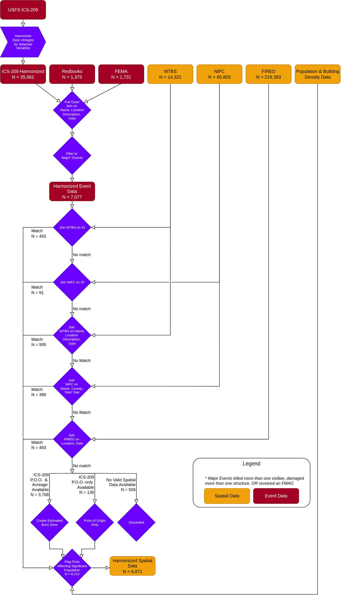

# Wildfire Wildfire Burn Zone Disaster (WFBZ) Data Harmonization

This program will harmonize wildfire and disaster data from several sources to produce a single geospatial data set. 
This project aims to be reproducible for future data releases, with as little manual input as possible.

## Data

The final data product is included in this directory as `wfbz.geojson`. See https://lpiep.github.io/wfbz_disasters_lite/
for a data dictionary and information on input data. 

## Run

Clone this repository. 

```
$ git clone https://github.com/lpiep/wildfire_disasters_lite.git
$ cd wildfire_disasters_lite
```

### System Requirements

* OS: This has been tested on Linux and MacOS. 
* Storage: We recommend at least 100GB free disk space.

### Dependencies

* `conda`
* `R`  

## Environments

Build the conda environment with 
```
conda env create -f wf.yml
conda activate wf
```

Build the R environment by opening R, and running `renv::restore()`. 

```
$ git clone https://github.com/lpiep/wildfire_disasters_lite.git
$ cd wildfire_disasters_lite
```

### Run data pipeline

```
chmod +x ./wfbz_disasters_lite.sh
./wfbz_disasters_lite.sh
```

## Data Sources

### Spatial 

* MBTS (updates on run)
* FIRED (updates on run)
* NIFC (updates on run)

### Non-Spatial

* FEMA Disaster Declarations (updates on run)
* ICS-209
  * Will be updated with access to API(s) (see https://github.com/lpiep/ics209_minimal)
  * The ICS209_minimal repository is configured to update itself automatically
* REDBOOKS 
	* Will need to manually redo each year as it currently stands. 

### Updating Docs

This repo has a documentation website at https://lpiep.github.io/wildfire_disasters_lite/.

It is created using `mkdocs` which is included in the `wf` conda environment. Make changes to 
the markdown files at `docs-site/docs/` to update content, and to the YML file at `docs-site/mkdocs.yml`
to update the site structure or add pages. 

To apply updates to the GH Pages site, run `mkdocs gh-deploy -f docs-site/mkdocs.yml`. Docs are also 
deployed when pushed to main. 


### Process


